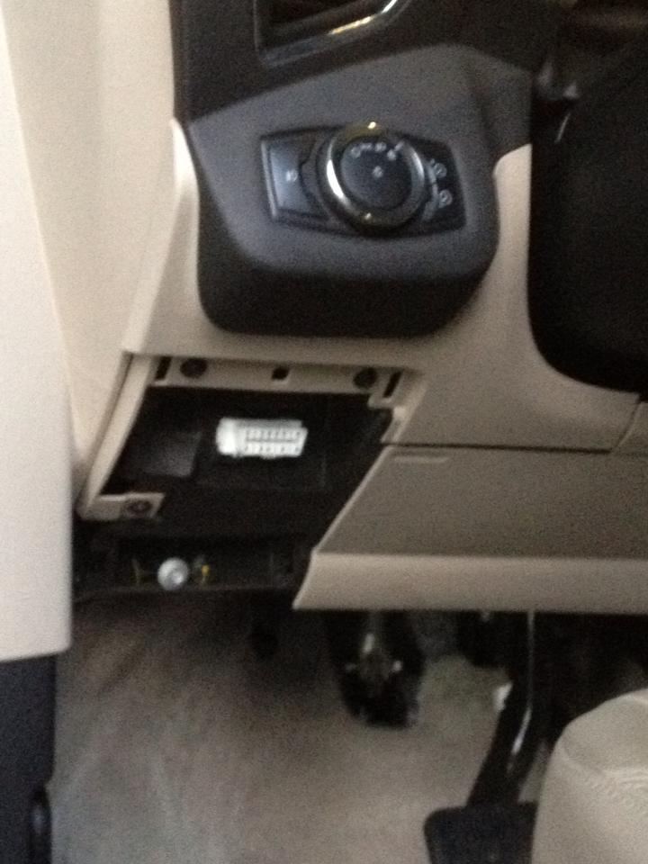
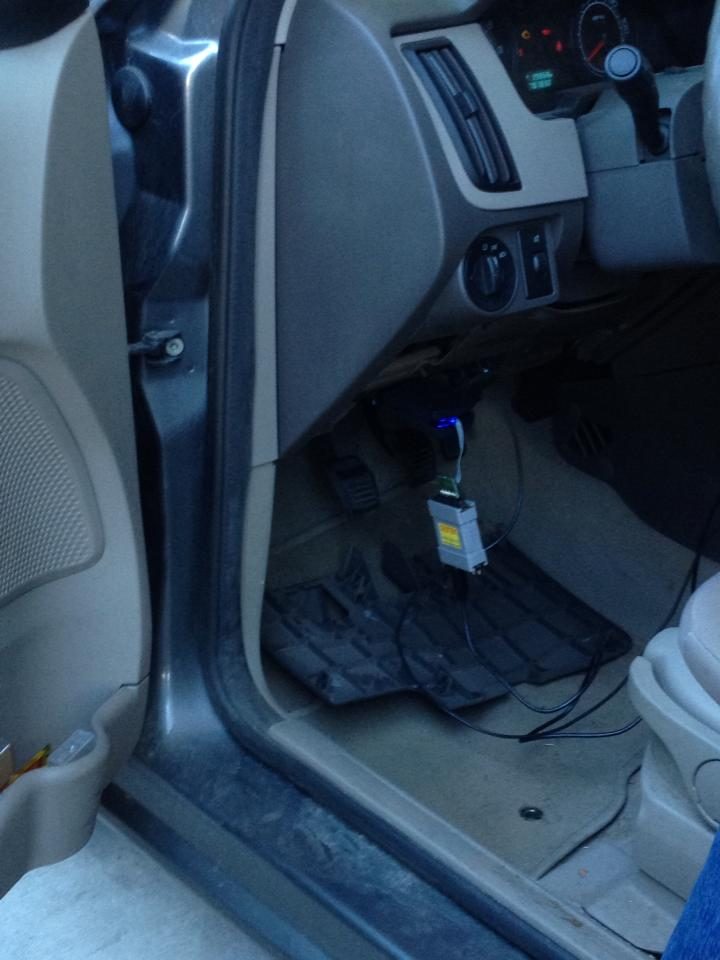

# TestOpenXC
 Testing android app for reading Ford vehicle data
 #### openXC
 OpenXC™ allows smart phones, to access data from any vehicle. Using OpenXC™, user can monitor many of the sensors on a vehicle, enabling new and innovative vehicle-centric applications. Some data is required by law and more can be unlocked with support from an automaker - or a little reverse engineering effort!
 #### Required: OBDII/Vehicle Interface
 The OBD-II port has one standard pin pair for a single CAN bus, but many automakers expose other buses on additional, non-standard pin pairs.   
 I used The Ford Reference VI and CrossChasm C5 Vehicle Interfaces from Ford OpenXC Shop. 
 The user can connect this device into OBDII interface in the car 
 After connecting device to OBDII interface , this translates proprietary CAN messages to the standard OpenXC message format and sends the output over USB, Bluetooth, or 3G/Ethernet/WiFi to a smart device app.
 #### challenge 
 1. Bluetooth connection
 2. Different message format depending on car manufacture/model 
 3. Unit transformation (minor)
 #### Result 
 This app provides vehicle data from OBD-II port.  Using Google MAP API, I added human-readable address information from a pair of geocode(latitude/longitude) using Reverse Geocoding. Applied AsyncTask to work in the background from UI thread. If Geocoder return multiple addresses then displays the top one however, it does not return any value then provide error message.
 Once the car slows down by listeing Vehicle speed information , I used notifies the user about current traffic status. 
 
 

 
 
 
